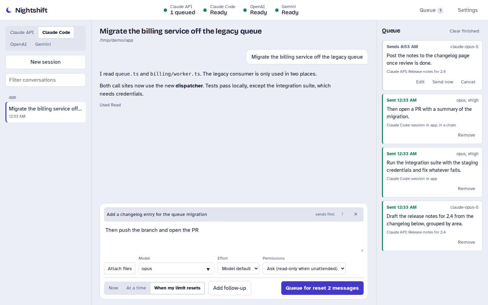
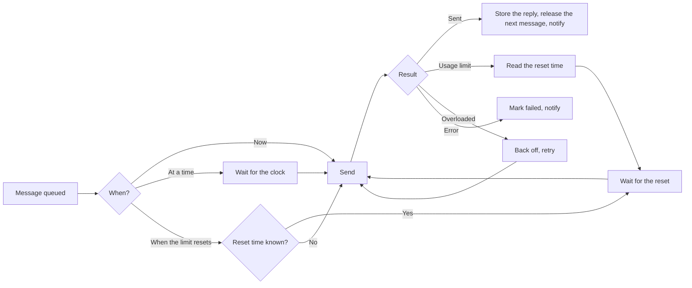

<div align="center">

<picture>
  <source media="(prefers-color-scheme: dark)" srcset="docs/assets/logo-dark.svg">
  
</picture>

### Queue messages for Claude, OpenAI and Gemini. They send at the time you pick, or the moment your usage limit resets.

[](LICENSE)
[](https://nodejs.org)
[](docs/getting-started.md#docker)
[](docs/security.md)

[Getting started](docs/getting-started.md) · [Usage](docs/usage.md) · [REST API](docs/api.md) · [Architecture](docs/architecture.md) · [Security](docs/security.md)

</div>

---

Your limit runs out at 11 PM and resets at 3 AM. Nightshift is a small self-hosted web app that holds your messages and sends them the second the limit lifts, so the work happens while you sleep. It talks to Claude Code, the Claude API, OpenAI and Gemini, and everything it does from the browser it can also do over a REST API, so n8n, cron, Home Assistant or your own scripts can drive it.

<picture>
  <source media="(prefers-color-scheme: dark)" srcset="docs/assets/screenshot-dark.png">
  
</picture>

## What it does

| | |
|---|---|
| **Send when the limit resets** | Reads the reset time out of Claude Code's limit message or the API's rate-limit headers, and sends the moment it lifts, with a countdown in the header |
| **Send at a time you pick** | Any date and time, in your own timezone |
| **Chain messages** | Queue several in a row; each waits for the reply before it, the way a person would |
| **Edit and delete** | Change the text, model, effort or timing of anything still waiting, or drop it and the chain re-links itself |
| **Four backends** | Claude Code (your Pro or Max plan), the Claude API, OpenAI, and Gemini, side by side |
| **Attachments** | Images, PDFs, code, text and video, by drag and drop, paste or file picker |
| **REST API** | Tokens, webhooks, long polling and live events, for orchestration tools |
| **Alerts** | ntfy, Discord, Slack or browser notifications when something sends or fails |

> [!NOTE]
> There is no claude.ai integration, because claude.ai has no public API. Automating it means replaying your browser session against private endpoints, which breaks without warning and goes against Anthropic's Consumer Terms. Claude Code is the supported way to use a Pro or Max subscription from a script, and it draws on the same plan, so queuing through the Claude Code tab covers the 3 AM reset.

## Quick start

```bash
git clone https://github.com/whereixuezugi/nightshift.git
cd nightshift
npm install
npm start          # http://127.0.0.1:8787
```

Or with Docker, which brings Claude Code and ffmpeg along:

```bash
cp .env.example .env     # set APP_PASSWORD
docker compose up -d --build
```

Add the keys you want in **Settings**. Claude Code signs in on its own with `claude`; the other three take an API key. Full instructions, including reverse proxies and access from your phone, are in [Getting started](docs/getting-started.md).

## Queue a message from a script

```bash
curl -X POST http://127.0.0.1:8787/v1/messages \
  -H "Authorization: Bearer $NIGHTSHIFT_TOKEN" \
  -H "Content-Type: application/json" \
  -d '{
    "provider": "claude-code",
    "cwd": "/srv/projects/api",
    "mode": "reset",
    "messages": [
      { "text": "Run the test suite and fix what fails." },
      { "text": "Then write the changelog entry." }
    ]
  }'
```

The first message goes out when your limit resets; the second follows once the first has a reply. Add `"webhook_url"` to be called as each one lands, or poll `GET /v1/jobs/{id}?wait=60`. See the [REST API reference](docs/api.md).

## How it decides when to send



The details, including how reset times are read out of each provider, are in [Architecture](docs/architecture.md).

## Documentation

- [Getting started](docs/getting-started.md) — install, Docker, remote access, updating
- [Configuration](docs/configuration.md) — every environment variable and setting
- [Usage](docs/usage.md) — providers, scheduling, chains, attachments, notifications
- [REST API](docs/api.md) — endpoints, tokens, webhooks, recipes, plus the [OpenAPI spec](docs/openapi.yaml)
- [Architecture](docs/architecture.md) — how the scheduler, providers and storage work
- [Security](docs/security.md) — what this app can reach, and how to lock it down
- [Troubleshooting](docs/troubleshooting.md) — when a message doesn't go out

<details>
<summary><strong>Project layout</strong></summary>

```
server.js                     HTTP server, sign-in, admin routes
lib/api.js                    the /v1 REST API, shared by the browser and by scripts
lib/jobs.js                   validation, chains, editing
lib/scheduler.js              the queue: limit waits, retries, webhooks
lib/providers/
  chat.js                     one runner for every HTTP chat provider
  anthropic.js                request, stream and error shapes per provider
  openai.js
  gemini.js
  claudeCode.js               headless runs, session history, reset-time parsing
  index.js                    the registry the rest of the app sees
lib/media.js                  file typing, ffmpeg frames, image conversion
lib/store.js                  JSON storage with atomic writes
public/                       the web app, no build step
test/                         unit and end-to-end tests against mock providers
```

</details>

<details>
<summary><strong>Running the tests</strong></summary>

```bash
npm test
```

The suite starts the real server against mock Anthropic, OpenAI and Gemini endpoints and a fake Claude Code CLI, then checks the things that are easy to get wrong: waiting out a 429, resuming a Claude Code session, chains running in order, and edits and deletes re-linking a chain. No network and no API keys needed.

</details>

## Contributing

Issues and pull requests are welcome. [CONTRIBUTING.md](CONTRIBUTING.md) covers the local setup and what the tests expect. Security reports go through [SECURITY.md](SECURITY.md).

## License

[MIT](LICENSE). The bundled fonts, Bricolage Grotesque and Atkinson Hyperlegible, are under the SIL Open Font License; see `public/fonts/`.
