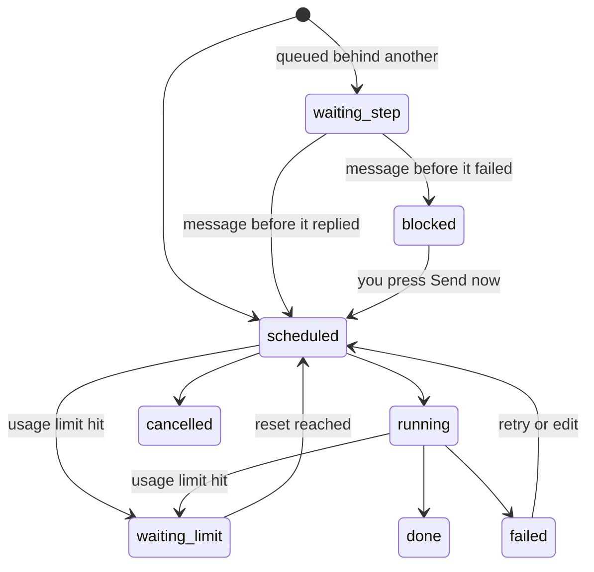

# REST API

Everything the web app does goes through this API, so anything it can do, a script can do. The browser authenticates with a session cookie; other tools use a token.

Base URL: `http://127.0.0.1:8787` · API root: `/v1` · Content type: `application/json`

## Tokens

Create one in **Settings → API tokens**. It is shown once and stored as a SHA-256 hash.

```bash
export NIGHTSHIFT=http://127.0.0.1:8787
export TOKEN=ns_xxxxxxxxxxxxxxxxxxxxxxxxxxxxxxxx

curl -s $NIGHTSHIFT/v1/ping -H "Authorization: Bearer $TOKEN"
# {"ok":true,"name":"nightshift","version":"2.0.0","api":"v1","now":1758400000000}
```

`X-API-Key: <token>` works too. For `GET /v1/events`, where headers are awkward, `?token=` is accepted.

> [!NOTE]
> Tokens can queue, edit and cancel messages and read every conversation. They cannot change settings or manage other tokens: that needs a signed-in browser session. Revoking a token takes effect immediately.

Request bodies accept `snake_case` or `camelCase`. Responses are `camelCase`.

## Endpoints

### Service

| Method | Path | Purpose |
|---|---|---|
| `GET` | `/v1/ping` | Liveness and version |
| `GET` | `/v1/providers` | Every provider, its readiness, capabilities, current limit and queue depth |
| `GET` | `/v1/models?provider=` | Models the provider reports |
| `POST` | `/v1/limits/{provider}/clear` | Declare a limit over and release what is waiting |
| `GET` | `/healthz` | Unauthenticated liveness, for Docker and uptime checks |

### Conversations

Chat providers only. Claude Code uses its own sessions.

| Method | Path | Purpose |
|---|---|---|
| `GET` | `/v1/conversations?provider=` | List |
| `POST` | `/v1/conversations` | Create: `{ provider, title?, model?, system? }` |
| `GET` | `/v1/conversations/{id}` | Full history, with attachments |
| `PATCH` | `/v1/conversations/{id}` | Change `title`, `system` or `model` |
| `DELETE` | `/v1/conversations/{id}` | Delete, cancelling anything queued for it |

### Claude Code sessions

| Method | Path | Purpose |
|---|---|---|
| `GET` | `/v1/sessions` | Sessions found on this machine, newest first |
| `GET` | `/v1/sessions/{id}` | Transcript of one session |

### Attachments

| Method | Path | Purpose |
|---|---|---|
| `POST` | `/v1/uploads` | Multipart, field `files`, up to 20 at once |
| `POST` | `/v1/uploads/base64` | `{ name, data, mime? }`, easier from a script |
| `GET` | `/v1/uploads/{id}` | Download |
| `DELETE` | `/v1/uploads/{id}` | Delete, unless a message still refers to it |

### Messages and the queue

| Method | Path | Purpose |
|---|---|---|
| `POST` | `/v1/messages` | Queue one message or a chain |
| `GET` | `/v1/jobs` | Filter by `status`, `provider`, `conversation_id`, `session_id`, `thread_key`, `since`, `limit` |
| `GET` | `/v1/jobs/{id}?wait=60` | One message; `wait` holds the connection until it finishes |
| `PATCH` | `/v1/jobs/{id}` | Edit anything not yet sent |
| `DELETE` | `/v1/jobs/{id}` | Delete; `?cascade=false` leaves the rest of the chain orphaned |
| `POST` | `/v1/jobs/{id}/cancel` | Stop it, including mid-send |
| `POST` | `/v1/jobs/{id}/retry` | Send now, ignoring a known limit |
| `GET` | `/v1/events` | Server-sent events: `job`, `jobRemoved`, `limits`, `live`, `conversation` |

## Queueing messages

`POST /v1/messages` takes one message or a list. Fields set at the top level apply to every message in the chain, and each message can override them.

```jsonc
{
  "provider": "anthropic",            // anthropic | openai | gemini | claude-code
  "conversation_id": "…",             // chat providers
  "cwd": "/srv/project",              // claude-code: the project folder
  "session_id": "…",                  // claude-code: resume an existing session
  "permission_mode": "acceptEdits",   // claude-code
  "model": "claude-opus-5",
  "effort": "high",                   // minimal | low | medium | high | xhigh | max
  "max_tokens": 16000,
  "mode": "reset",                    // now | at | reset | after
  "run_at": "2026-09-21T03:30:00Z",   // mode "at": ISO string or epoch ms
  "retry_on_limit": true,
  "webhook_url": "https://example.com/hook",
  "messages": [
    { "text": "First message", "files": ["<upload id>"] },
    { "text": "Second message", "delay_seconds": 30 }
  ]
}
```

A single message can skip the array entirely: `{ "provider": "openai", "conversation_id": "…", "text": "hello" }`.

### Modes

| Mode | When it sends |
|---|---|
| `now` | Next scheduler tick |
| `at` | At `run_at` |
| `reset` | When that provider's limit lifts, or now if nothing is limited |
| `after` | Once the message before it has a reply. The default for every message after the first |

The response is the jobs that were created, in order:

```json
{ "jobs": [ { "id": "…", "status": "scheduled", "nextAttemptAt": 1758400000000, "dependsOn": null }, … ] }
```

### Job states



A finished job carries `result`:

```json
{
  "status": "done",
  "attempts": 2,
  "result": {
    "text": "…the reply…",
    "usage": { "input_tokens": 812, "output_tokens": 1190 },
    "sessionId": "…",        // claude-code
    "costUsd": 0.21,         // claude-code
    "note": "Effort isn't supported by this model, so it was left out."
  }
}
```

## Webhooks

Set `webhook_url` on a message, and Nightshift `POST`s to it when the message finishes:

```json
{
  "event": "message.sent",
  "job": { "id": "…", "provider": "claude-code", "status": "done", "result": { "text": "…" } },
  "at": "2026-09-21T03:01:30.000Z"
}
```

`message.failed` has the same shape with `lastError` set. The call times out after 15 seconds and is not retried, so treat it as a nudge and read the job for the truth.

## Recipes

### Wait for a reply in a shell script

```bash
ID=$(curl -s $NIGHTSHIFT/v1/messages -H "Authorization: Bearer $TOKEN" \
  -H 'Content-Type: application/json' \
  -d '{"provider":"openai","conversation_id":"'$CONV'","text":"Summarise today'\''s incidents"}' \
  | jq -r '.jobs[0].id')

curl -s "$NIGHTSHIFT/v1/jobs/$ID?wait=120" -H "Authorization: Bearer $TOKEN" | jq -r '.result.text'
```

### Queue overnight work at 3 AM, from cron

```bash
0 22 * * * curl -s $NIGHTSHIFT/v1/messages -H "Authorization: Bearer $TOKEN" \
  -H 'Content-Type: application/json' \
  -d '{"provider":"claude-code","cwd":"/srv/api","mode":"reset","permission_mode":"acceptEdits",
       "messages":[{"text":"Work through the TODOs in docs/backlog.md"},{"text":"Then summarise what changed"}]}'
```

### Attach a file from Python

```python
import requests
ns, token = "http://127.0.0.1:8787", "ns_…"
h = {"Authorization": f"Bearer {token}"}

up = requests.post(f"{ns}/v1/uploads", headers=h, files={"files": open("report.pdf", "rb")}).json()[0]
requests.post(f"{ns}/v1/messages", headers=h, json={
    "provider": "gemini",
    "conversation_id": conv_id,
    "text": "Pull out every number that changed since last quarter.",
    "files": [up["id"]],
})
```

### Follow the queue live

```bash
curl -N "$NIGHTSHIFT/v1/events?token=$TOKEN"
```

```
event: job
data: {"id":"…","status":"running",…}

event: live
data: {"jobId":"…","text":"partial reply so far"}
```

## Errors

Standard status codes with `{ "error": "…" }`. The messages are meant to be read by a person: `run_at is in the past.`, `Unknown attachment id "…". Upload it first.`, `That conversation belongs to "openai", not "anthropic".`

| Code | Meaning |
|---|---|
| `400` | The request is wrong; the message says how |
| `401` | No or bad credentials |
| `403` | A token tried to do something that needs a browser session |
| `404` | No such conversation, message or session |
| `500` | A bug. Check the server log and please open an issue |

A machine-readable description of all of this lives in [openapi.yaml](openapi.yaml).
