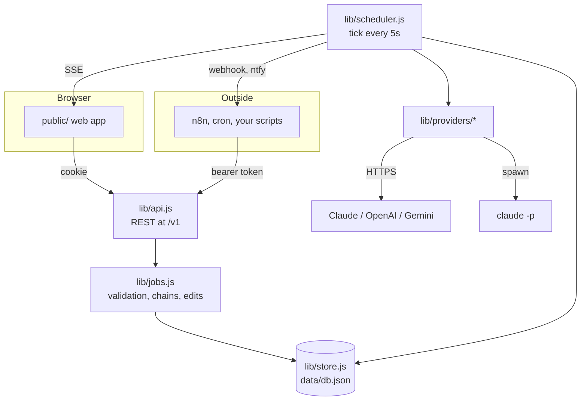
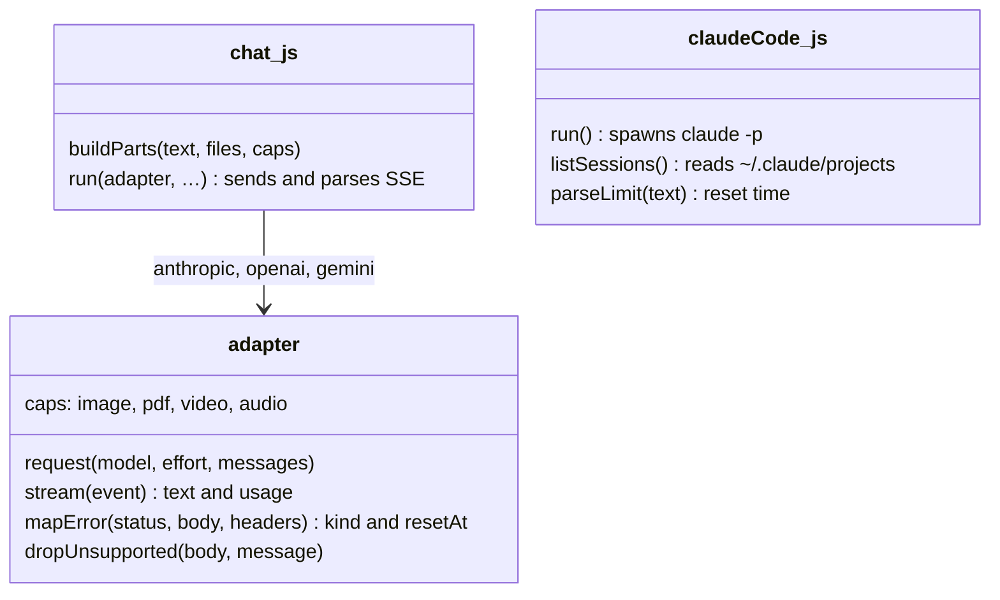

# Architecture

A single Node process: an HTTP server, a scheduler on a timer, a provider layer, and a JSON file. No database, no queue broker, no build step.



## The unit of work: a job

Queueing a message creates a job. It holds the message, the attachments, the provider settings, when it should run, and where it goes.

```jsonc
{
  "id": "uuid",
  "provider": "claude-code",
  "prompt": "Run the tests",
  "files": ["upload-id"],
  "model": "opus", "effort": "high", "maxTokens": 0,
  "mode": "reset",              // now | at | reset | after
  "runAt": null, "delayMs": 0,
  "dependsOn": "uuid-of-previous",
  "threadKey": "conv:… or the Claude Code session",
  "conversationId": "…",        // chat providers
  "sessionId": "…", "cwd": "/srv/api", "permissionMode": "acceptEdits",
  "retryOnLimit": true, "webhookUrl": "",
  "status": "waiting_limit",
  "nextAttemptAt": 1758400000000,
  "attempts": 1, "limitWaits": 1, "transientTries": 0,
  "result": null, "lastError": "…"
}
```

## The scheduler

`Scheduler.tick()` runs every five seconds, and immediately after anything changes.

1. **Fix up chain states.** A job whose predecessor has not replied becomes `waiting_step`. If the predecessor failed or was cancelled, it becomes `blocked` and waits for you.
2. **Pick the due jobs, per provider.** Due means: status `scheduled` or `waiting_limit`, dependencies satisfied, and `nextAttemptAt` in the past.
3. **Keep each thread in order.** If an older job in the same conversation is still active, it goes first, and the younger one is pushed behind it. This is what makes "queue three messages while the first is still running" behave the way it reads.
4. **Respect a known limit.** If that provider is limited until a known time, every due job is parked behind the reset instead of being sent and rejected. One run per provider at a time, so a subscription is never hammered.
5. **Run it**, streaming partial output to the browser over SSE as it arrives.
6. **Settle the result** (below), then tick again straight away in case the queue can move.

On startup, anything left `running` by a crash or restart goes back to `scheduled`.

### Settling a result

| Outcome | What happens |
|---|---|
| **Sent** | Reply stored on the conversation, limit for that provider cleared, dependents released, webhook and notification fired |
| **Usage limit** | Reset time recorded for the provider; this job and everything queued for it move behind it. Notification the first time. Up to 40 waits |
| **Out of credit** | Same, but polled every 30 minutes at most, since it will not fix itself on a clock |
| **Overloaded or network error** | Exponential backoff, 2 to 30 minutes, up to 6 tries |
| **Anything else** | Marked failed, dependents blocked, webhook and notification fired |

### Finding the reset time

This is the part that matters most, and each provider says it differently.

| Provider | Where the time comes from |
|---|---|
| **Claude Code** | The CLI's own message: `usage limit reached\|<epoch>`, `resets 3am`, `resets 3:30pm (America/New_York)`, `resets Sep 21, 5pm`, `resets in 2h 15m` |
| **Claude API** | `retry-after`, else the `anthropic-ratelimit-*-reset` header whose quota is exhausted |
| **OpenAI** | `retry-after`, else `x-ratelimit-reset-tokens` / `-requests`, which use durations like `6m0s` |
| **Gemini** | The `RetryInfo` detail on the 429, e.g. `retryDelay: "35s"`, else `retry-after` |

Bare clock times are resolved in the timezone printed alongside them, or the server's own, and roll to tomorrow when the time has already passed today. Parsing all of this is covered by unit tests in `test/parse-limit.test.js`.

When a limit arrives with no time attached, the provider is marked limited for the polling interval (15 minutes by default) and tried again then, so an unrecognised message costs you a delay rather than a missed send.

## The provider layer



`chat.js` owns everything the three HTTP providers share: turning a stored turn plus its attachments into provider-neutral parts, streaming the response, retrying once without a parameter a model rejects, and classifying errors. Each adapter is about a hundred lines describing only what is different: the URL and headers, how content blocks are shaped, where effort lives, how an error reports a reset.

Adding a provider means writing one adapter and registering it. Nothing else in the app knows the difference.

**Attachments** are prepared per provider from its `caps`. An image too large for the Claude API is downscaled with ffmpeg; a video is turned into evenly spaced frames unless the provider reads video directly, as Gemini does; a text file is inlined in a `<file>` tag; anything unreadable is described in words rather than dropped silently. Frames are cached next to the upload, so a video in a long conversation is only decoded once.

**Claude Code** is not an HTTP API. It is `claude -p --output-format stream-json --verbose`, with the prompt on stdin so length and quoting never matter, plus `--model`, `--effort`, `--resume`, `--permission-mode` and `--add-dir` for attachment folders. Sessions are read straight from the JSONL transcripts in `~/.claude/projects`, so the app shows the same history you see in the terminal, and a scheduled message continues the session you were working in.

## Storage

`data/db.json`, written atomically and debounced, holding conversations, jobs, uploads metadata, settings and hashed tokens. It is a deliberate choice: the whole state of a personal scheduler is a few hundred kilobytes, a JSON file is trivially inspectable and backed up, and there is no server to run alongside. Uploads are files on disk under `data/uploads/<id>/`.

The trade-off: one process only. Do not run two instances against the same data directory.

## Authentication

Two ways in, deliberately unequal:

- **Session cookie** — `HttpOnly`, `SameSite=Strict`, signed with a random secret in `data/.secret`, obtained by posting the password. Full access, including settings and tokens.
- **API token** — `ns_` plus 24 random bytes, compared in constant time against a SHA-256 hash. Can use the queue and read conversations. Cannot touch settings or tokens, so a token leaking from an automation tool cannot rewrite where your keys point.

## Events

`GET /v1/events` is a plain SSE stream, used by the browser and available to anything else:

| Event | Fires when |
|---|---|
| `job` | A job is created or changes state |
| `jobRemoved` | A job is deleted |
| `limits` | A provider becomes limited, or the limit clears |
| `live` | Partial output while a message is being answered, at most every 400 ms |
| `conversation` | A conversation gained a reply |

## What it deliberately does not do

- **No claude.ai automation.** No public API exists; see the note in the README.
- **No multi-user accounts.** One password, one person, one queue. Run separate instances per person.
- **No telemetry.** The app talks to the providers you configure, your notification URL, and nothing else.
